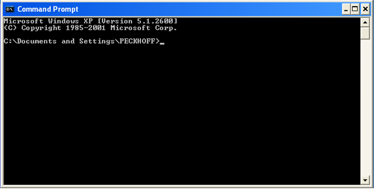
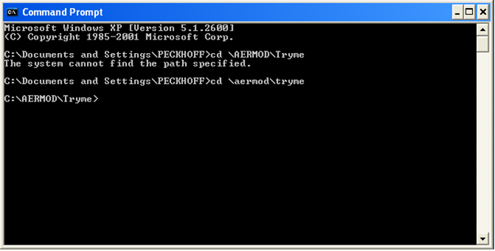
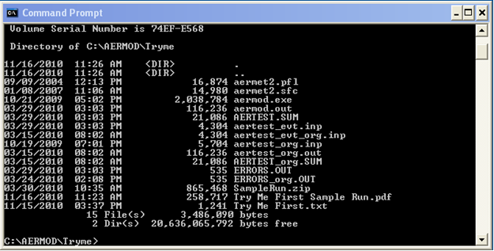
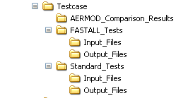

# Try Me First Sample Run

A number of users who are being exposed to AERMOD for the first time, are running into problems 
just setting up the test cases and running them. Try Me First is designed for the novice to setup 
and **successfully** run an AERMOD sample run.

The use of AERMOD requires a user to read the manuals and in particular, to **understand** what 
they are trying to convey. Try Me First is simply a “plug and crunch” example to familiarize the 
user with how to set up and run AERMOD in a generic sense. Any understanding needs to come from 
reading the guides.

AERMOD was coded so that the input file has to be named `AERMOD.INP`. The batch files in the 
actual test cases, copy a test case input file to `AERMOD.INP` before executing AERMOD. Here is 
a copy of a segment of one of those batch files:

```terminal
copy aertest.inp aermod.inp aermod
copy aermod.out aertest.out
```

Note that the output file is `AERMOD.OUT` and needs to be copied from `AERMOD.OUT` to another 
file. If this is not done, `AERMOD.OUT` will be over written next time **AERMOD** is run and 
you will lose whatever data was in the previous `AERMOD.OUT` file.

Many a first time user will go into Windows Explorer, double click on **AERMOD.EXE** and then 
call us wondering why a window blinked open and shut with no indication of anything happening. 
You **did** run **AERMOD** but you have no idea of whether it was a successful run or not. You 
need to run **AERMOD** from the Windows Command Prompt to see any error or success messages. 
**AERMOD** was designed to run from a Command Prompt window (e.g. Start | All Programs | 
Accessories | Command Prompt).

The Command Prompt window looks like this initially:



However, we need to go to C:\AERMOD\Tryme. How is that done in DOS?
 
Here are some sample DOS commands to enter at the Command Prompt (>): 
```terminal
  cd \ - takes you to the top directory in whatever drive you are on 
  cd \document* - takes you to the "documents and settings" subdirectory 
  cd MY* - takes you from the "Documents and settings" subdirectory to
                the "MY Documents" subdirectory (if you were previously in 
                the "Documents and Settings" subdirectory)
  copy file1 file2 – copies the file contents of file1 to file2 
                     (e.g. copy aertest1.out aermod.out)
```

So to go to the Tryme subdirectory, I would type: 
`cd \AERMOD\Tryme` and then press the Enter key. I would then see:



Type DIR at the Command Prompt and you should see:



```terminal
Extention            Meaning
*.pfl              Upper level wind profile
*.sfc              Surface meteorological data
*.exe              executable file
*.inp              input file
*.out              output file
*.sum              summary file
Errors.*           File containing error messages generated during run attempt
```

The `*.pfl` and `sfc` files are prepared using **AERMET**. Land Characteristics are part of 
the surface meteorological data file and the land characteristics are prepared using 
**AERSURFACE**. The output from **AERSURFACE** is incorporated with the meteorological data 
in **AERMET**.


This part of the instructions assumes that you followed the Initial Installations Instructions 
If not, please find those instructions and act upon them.

## Sample run:

This sample AERMOD installation and run test case was gleaned from the test case file that is 
posted to SCRAM. The instructions should be straight forward but addition information has been 
included for those who are unfamiliar with DOS. If you run into problems, we are available 
through the SCRAM web site "Contact us" page.

```terminal
1) Execute the Command Prompt (e.g. Start | All Programs | Accessories | Command Prompt)
2) Use the cd command to go to your Tryme subdirectory (e.g. cd \aermod\tryme)
3) Unzip SampleRun.ZIP - If you have not already done so already. Please use either PKUNZIP or WinZip as we have had a few reported problems with other third party unzipping programs.
4) At the Command Prompt, type: DIR to see if all the files are there as shown on the previous page.
5) Type: copy AERtest_org.INP AERMOD.INP this copies the original input file to an input file name that AERMOD is source coded to open and read.
6) At the Command Prompt window, type: AERMOD

-- this will run the sample run test case
Note: aertest.inp has already been copied to aermod.inp

Note: An AERMOD.EXE file was also included and should **not** be used for production runs. It was provided for
ease of operations.

7) Use the DOS FC command to compare file output. For example, at the Command Prompt, type:
FC aertest.sum aertest_org.sum FC aermod.out aertest_org.out

Some difference output should only have lines containing date or time which will be difference. Some files should have no differences.
 
There might be cases where "0.00" is represented as " .00" or "1.45678" might be "1.45677". The FC command will find all such differences and they should be ignored as they are insignificant.

Commercial text editors such as Ultra Edit have their own File Compare functions that can be used instead of the FC command.

8) Once satisfied that you have successfully installed and run AERMOD, please delete AERMOD.EXE so that if it is an older version,
it does **not** make its way into being used in a production run.

9) If you have any questions or issues with these instructions, please contact us through our SCRAM web site using its “Contact Us” feature.

```

## Real Test Cases

SCRAM contains a set of test cases. The test cases unzip into a subdirectory tree like so:



Note: The ```Input_Files``` subdirectories do NOT contain the AERMOD executable!!

You will need to download the current AERMOD executable and copy it into each of the two 
```Input_Files``` subdirectories before running the test cases.

## Additional Information and Notes

**PLEASE READ AND UNDERSTAND WHAT IS IN THE USER’S GUIDES AND MANUALS!!!!!** We can not 
emphasize this enough. AERMOD and its supporting systems are complex and do not lend 
themselves to *plug and crunch*.

The executables and source codes do not of themselves require much space. However, the models 
use something called *Allocatable Arrays* which adjust the variable array sizes to meet the 
needs for large receptor grids and other such variables which can also form additional large 
array sizes. Very large variable arrays can affect RAM memory to the point where the RAM memory 
can not hold all the variable data. At that point, a run can be adversely affected by either 
stopping, crashing or by using the hard drive as a storage location (e.g. virtual memory). If 
the later, performance will be drastically slowed as data is read onto and from the user's 
hard drive. Most AERMOD runs will not encounter this unless a large run is being performed on 
an older PC with minimum RAM memory. At this point, the run should be broken into separate runs.

Additional hard disk drive space is needed for the various input data sets. For instance, 
detailed terrain data input for an AERMAP run can approach 1 Gigabyte when used in preparation 
of a 50 km radius AERMOD run. Details such as this will be covered in the revised addition of 
the AERMOD User's Guide.

It is advisable to create a general overall subdirectory for each project with subdirectories 
for each part of the AERMOD modeling system. This way it will be easier to backup your project 
by copying the main project subdirectory and all it underlying subdirectories.

## Normal AERMOD Installation Help

Each part of the AERMOD modeling system (e.g. AERMAP, AERSURFACE, AERMET, etc.) should be stored 
in its own subdirectory. The output from each segment of the system, such as the meteorological 
data or land characteristics, will need to be copied to the subdirectory where the user's AERMOD 
run will be executed. Path names can sometimes be used to point back to where the data is located 
and therefore, the data does not have to be copied to the executable's subdirectory.

Input to each executable has to be renamed or copied to the basic file name of the executable. 
For instance, when executing an AERMOD run, `myinputfile.inp` has to be renamed to `AERMOD.INP`. 
The output file will be `AERMOD.OUT` and will have to be renamed to `myoutputfile.out` or it 
will be over written next time AERMOD is run. It is important to read each User's Guide for any 
variations that do not follow this generic procedure. This helps us to make AERMOD compatible 
with other Operating System environments.

It is advisable to create a general overall subdirectory for each project with subdirectories 
for each part of the AERMOD modeling system. This way it will be easier to backup your project 
by copying the main project subdirectory and all it underlying subdirectories.
<!--
***********************************************************************************************
-->
